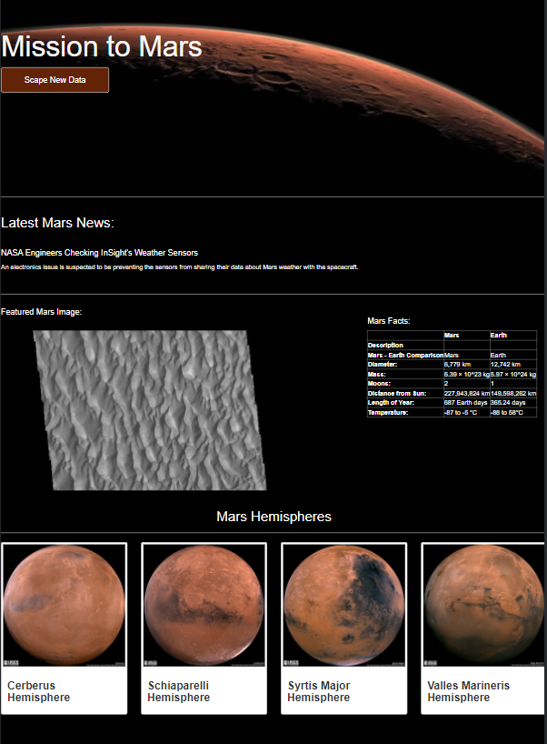

# Module 10: Mission to Mars - Web Scraping with HTML/CSS & NoSQL
## Resources

- **Data Sources Scraped from Web:** 
  - https://redplanetscience.com/
  - https://spaceimages-mars.com
  - https://galaxyfacts-mars.com
  - https://marshemispheres.com
- **Software:** Python, BeautifulSoup, Splinter, HTML, CSS, Bootstrap, Flask, MongoDB, NoSQL, Visual Studio Code

## Challenge Project Overview 

Using Python libraries BeautifulSoup and Splinter, I automated Google Chrome to visit different websites to extract data about the Mission to Mars and then store it in a MongoDB NoSQL database. Then I rendered the data into a web application created with Flask. Afterward, I created an HTML/CSS portfolio to display my findings. Finally, I implemented Bootstrap components to polish and customize my portfolio. 

## **Webpage Preview**

